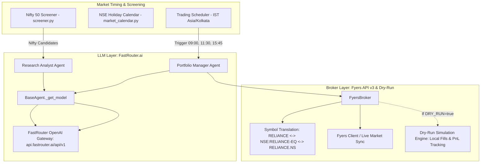

# Walkthrough: Indian Broker (Fyers API v3), FastRouter.ai & Dry-Run Mode

This document summarizes the complete implementation adapting the swing trading agent for the Indian equity markets using **Fyers API v3** for broker execution, **FastRouter.ai** as the LLM provider, and the newly added **Dry-Run Simulation Mode**.

---

## 1. Architecture Overview



---

## 2. Components Modified & Created

| Component | File | Action | Purpose |
|---|---|---|---|
| **Dependencies** | [requirements.txt](file:///Users/sanket.gupt/Documents/code/Personal/swing-trading-agent/requirements.txt) | Modified | Added `fyers-apiv3>=3.1.0`, `openai>=1.40.0`, `pyotp>=2.9.0` |
| **Settings** | [config/settings.py](file:///Users/sanket.gupt/Documents/code/Personal/swing-trading-agent/config/settings.py) | Modified | Added FastRouter, Fyers, Nifty universe (`nifty50`), IST schedules, `dry_run`, and `dry_run_initial_cash` |
| **CLI & Entry** | [main.py](file:///Users/sanket.gupt/Documents/code/Personal/swing-trading-agent/main.py) | Modified | Added `--dry-run` flag and simulation mode logging banner |
| **Environment Template** | [.env.example](file:///Users/sanket.gupt/Documents/code/Personal/swing-trading-agent/.env.example) | Modified | Added FastRouter, Fyers, and `DRY_RUN=false` settings |
| **LLM Provider** | [agents/base_agent.py](file:///Users/sanket.gupt/Documents/code/Personal/swing-trading-agent/agents/base_agent.py) | Modified | Added `_get_model()` using `strands.models.openai.OpenAIModel` for FastRouter |
| **Research Analyst** | [agents/research_analyst_agent.py](file:///Users/sanket.gupt/Documents/code/Personal/swing-trading-agent/agents/research_analyst_agent.py) | Modified | Uses generalized `_get_model()` |
| **Symbol Converter** | [tools/data/symbols.py](file:///Users/sanket.gupt/Documents/code/Personal/swing-trading-agent/tools/data/symbols.py) | Created | Converts `TCS` ↔ `NSE:TCS-EQ` (Fyers) ↔ `TCS.NS` (yfinance) |
| **NSE Calendar** | [tools/execution/market_calendar.py](file:///Users/sanket.gupt/Documents/code/Personal/swing-trading-agent/tools/execution/market_calendar.py) | Modified | NSE trading holidays (2025–2027) & `is_indian_market_open_today()` |
| **Fyers Broker** | [providers/fyers_broker.py](file:///Users/sanket.gupt/Documents/code/Personal/swing-trading-agent/providers/fyers_broker.py) | Created | Implements `Broker` interface for live trading + local dry-run order simulation |
| **Fyers Orders & Client** | [tools/execution/fyers_client.py](file:///Users/sanket.gupt/Documents/code/Personal/swing-trading-agent/tools/execution/fyers_client.py), [fyers_orders.py](file:///Users/sanket.gupt/Documents/code/Personal/swing-trading-agent/tools/execution/fyers_orders.py) | Created | CNC order execution, GTT stop loss, and order polling |
| **Portfolio Agent** | [agents/portfolio_agent.py](file:///Users/sanket.gupt/Documents/code/Personal/swing-trading-agent/agents/portfolio_agent.py) | Modified | Routes to `FyersBroker` when `broker_type == "fyers"` |
| **Universe Screener** | [tools/data/screener.py](file:///Users/sanket.gupt/Documents/code/Personal/swing-trading-agent/tools/data/screener.py) | Modified | Added Nifty 50 constituent list and sector mappings |
| **Settings UI & API** | [frontend/src/pages/Settings.tsx](file:///Users/sanket.gupt/Documents/code/Personal/swing-trading-agent/frontend/src/pages/Settings.tsx), [api/routes/settings.py](file:///Users/sanket.gupt/Documents/code/Personal/swing-trading-agent/api/routes/settings.py) | Modified | FastRouter & Fyers configuration inputs + `₹` currency symbol |
| **Tests** | [tests/test_dry_run.py](file:///Users/sanket.gupt/Documents/code/Personal/swing-trading-agent/tests/test_dry_run.py) | Created | Unit tests for dry-run simulation mode and CLI flag |

---

## 3. How Dry-Run Mode Works

When running with `--dry-run` or `DRY_RUN=true`:
1. **Live Market Data is Active**: The agent uses live price bars, Nifty screener data, and news articles to analyze the real market.
2. **LLM Reasoning is Active**: FastRouter.ai powers the Research Analyst and Portfolio Manager agents to make authentic decisions against live market setups.
3. **Broker Calls are Intercepted**:
   - `FyersBroker.sync()`: Seeds simulated cash (default ₹5,00,000 INR) and tracks positions and unrealized P&L without requiring valid Fyers credentials.
   - `FyersBroker.submit_entry()`: Logs `[DRY RUN] Simulated CNC BUY`, calculates cost, deducts cash, and adds position to memory and `state/portfolio.json`.
   - `FyersBroker.update_stop()`: Adjusts trailing stops in memory without touching exchange GTT orders.
   - `FyersBroker.execute_exit()`: Logs `[DRY RUN] Simulated CNC SELL`, computes realized P&L, credits proceeds back to cash, and closes position.

---

## 4. Verification & Test Results

All tests have been executed in the project virtual environment (`./.venv/bin/pytest`).

### Dry-Run & Indian Markets Test Suite
```bash
./.venv/bin/pytest tests/test_dry_run.py tests/test_symbols.py tests/test_indian_calendar.py tests/test_fyers_broker.py tests/test_fastrouter_model.py -v
```
**Results: 15 passed in 1.45s**
- `tests/test_dry_run.py`: Verified `sync()` without credentials, cash management, simulated buys, stop modifications, and sell exits with P&L.
- `tests/test_symbols.py`: Verified `RELIANCE` ↔ `NSE:RELIANCE-EQ` ↔ `RELIANCE.NS`.
- `tests/test_indian_calendar.py`: Verified NSE holiday calendar and weekday checks.
- `tests/test_fyers_broker.py`: Verified live API paths for funds, holdings, and orders.
- `tests/test_fastrouter_model.py`: Verified OpenAI-compatible model initialization with custom endpoint.

### Full Repository Test Suite
```bash
./.venv/bin/pytest tests/ -q
```
**Results: 526 passed, 10 skipped, 0 failures in 3.04s**

---

## 5. How to Run the Agent

### Step 1: Set up `.env`
```bash
cp .env.example .env
# Enter FASTROUTER_API_KEY in .env
```

### Step 2: Run in Dry-Run Mode (Zero Risk)

#### Run a Single Cycle
```bash
# EOD scan on Nifty 50 (Screening + News Research + PM Decisions)
./.venv/bin/python main.py --cycle EOD_SIGNAL --dry-run

# Morning cycle (Executes simulated entry orders)
./.venv/bin/python main.py --cycle MORNING --dry-run

# Intraday cycle (Monitors simulated trailing stops)
./.venv/bin/python main.py --cycle INTRADAY --dry-run
```

#### Run the Live Scheduler in Dry-Run Mode
```bash
# Automatically triggers Morning (09:00), Intraday (11:30), and EOD (15:45) IST cycles
# Orders will be simulated locally and persisted to state/portfolio.json
./.venv/bin/python main.py --dry-run
```
